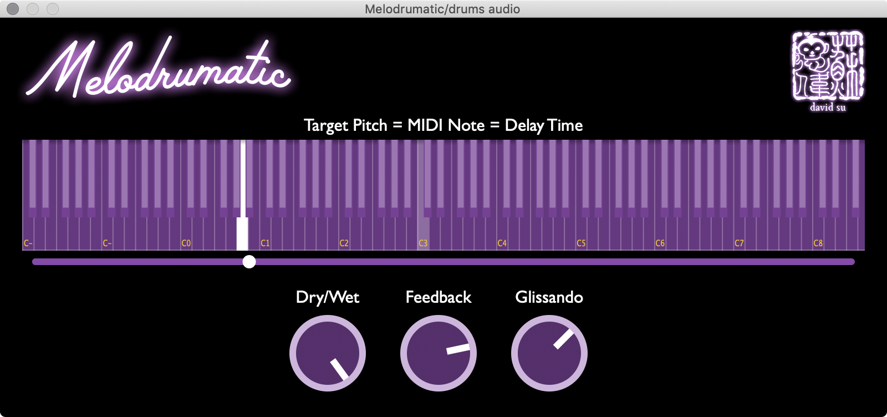

# Melodrumatic

## Overview
Melodrumatic is an audio plugin that lets you "pitch-shift" via delay (i.e. the Doppler effect) to turn unpitched audio into melodies. Controllable via MIDI or mouse :)

## Available Formats
VST3, AU

## Contact
Please [get in touch](mailto:hello@usdivad.com) if you end up making any cool music or sounds using this! (or if you have any questions/comments/etc.)